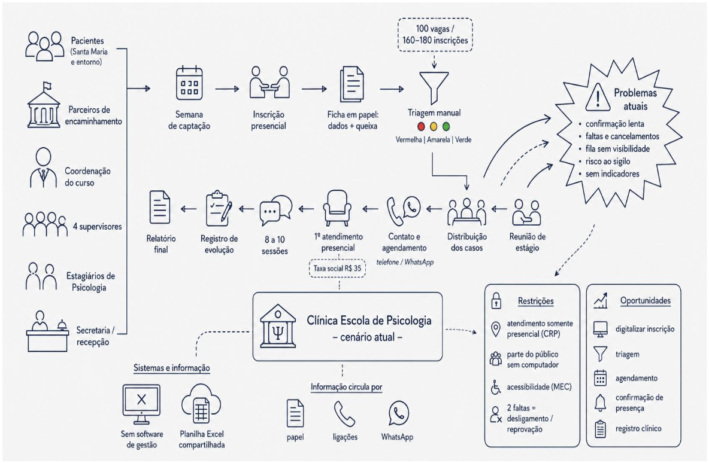
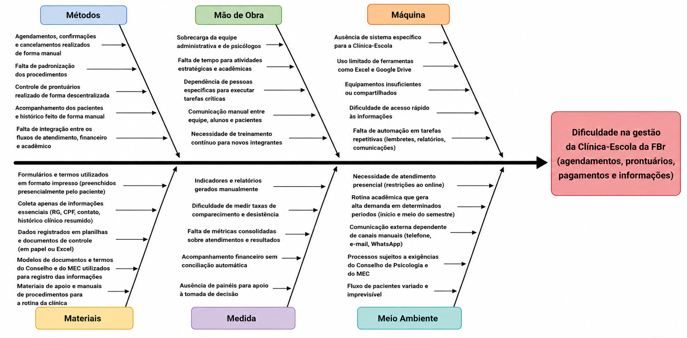

# 1. Cenário Atual do Cliente e do Negócio

## 1.1 Identificação do Cliente/Parceiro

- **Nome:** Faculdade Brasília

- **Tipo:** Instituição de Ensino Superior

- **Representantes:** Robson Luís de Araújo (Coordenador do Curso de Psicologia, responsável pela Clínica Escola),
 Thiago Cardoso Viana (Diretor de Financeiro e de Tecnologia),
 Karla Gardene Baima (Secretária Acadêmica).

- **Forma de contato:** Reuniões periódicas por videoconferência, e-mail e canal de mensagens instantâneas

- **Vínculo com o projeto:** Cliente real e parte interessada principal, responsável por fornecer informações sobre o negócio, validar as decisões do projeto e avaliar as entregas realizadas ao longo do desenvolvimento.

## 1.2 Introdução ao Negócio e Contexto

A **Faculdade Brasília - FBr** é uma instituição de ensino superior privada, credenciada pelo Ministério da Educação (MEC) e sediada na Avenida Santa Maria, na Região Administrativa de Santa Maria, no Distrito Federal. Idealizada desde a década de 1990 e inaugurada em 08 de agosto de 2019 com aproximadamente 1500 alunos, a instituição atua hoje com graduação presencial e a distância, pós-graduação, extensão universitária e escola técnica, em cursos como Direito, Enfermagem, Psicologia, Análise e Desenvolvimento de Sistemas e Pedagogia.

Sua missão está diretamente vinculada ao compromisso com a RA de Santa Maria e as cidades circunvizinhas, o que se materializa em projetos de responsabilidade social nos quais os alunos prestam serviços gratuitos à comunidade, como as ações de saúde em parceria com a Administração Regional de Santa Maria e o projeto Outubro Rosa.

É nesse contexto que se insere a **Clínica Escola do curso de Bacharelado em Psicologia**, curso presencial de dez semestres cuja proposta pedagógica prevê que os estágios e as práticas supervisionadas sejam oportunidades de oferta de atendimento psicológico à população, principalmente à comunidade economicamente desfavorecida, local e regional.

A Clínica Escola cumpre, assim, uma dupla finalidade:

- **Para os estudantes:** é o ambiente de formação prática obrigatória, no qual os alunos dos semestres finais realizam atendimentos sob supervisão de professores psicólogos.
- **Para a comunidade:** é um projeto social que amplia o acesso a cuidado em saúde mental para moradores de Santa Maria e do entorno do Distrito Federal que, em geral, não dispõem de condições financeiras para custear atendimento particular.

Apesar da relevância do serviço, toda a operação é conduzida hoje de forma presencial e manual, sem o apoio de qualquer ferramenta de gestão: a solicitação de atendimento, a triagem, a fila de espera, a distribuição dos casos entre os estagiários, o agendamento das sessões, o registro da evolução dos atendimentos e a extração de indicadores para a coordenação dependem integralmente do deslocamento do interessado até a instituição e de controles feitos à mão.

Esse é o cenário no qual o projeto se propõe a atuar.

## 1.3 Rich Picture

O Rich Picture da Figura 1 representa o cenário atual da Clínica Escola de Psicologia da Faculdade Brasília, com base no levantamento realizado em 26 de agosto de 2026 junto à coordenação do curso de Psicologia, à diretoria financeira e de tecnologia e à secretaria acadêmica.

> **Figura 1 - Rich Picture do cenário atual da Clínica Escola de Psicologia da FBr.**

O processo envolve pacientes, parceiros de encaminhamento, coordenação, supervisores, estagiários e secretaria. Atualmente, a captação e a inscrição ocorrem presencialmente, com preenchimento de fichas em papel e classificação manual dos pacientes conforme a prioridade de atendimento. A clínica disponibiliza aproximadamente 100 vagas por semestre para uma demanda de 160 a 180 inscrições.

Após a triagem, os casos são distribuídos entre supervisores e estagiários, que realizam o contato e o agendamento principalmente por telefone e WhatsApp. Os atendimentos são presenciais e compreendem, em média, de 8 a 10 sessões, com registro da evolução e elaboração de relatório final do estado do paciente.

Não há atualmente um sistema integrado de gestão. As informações são mantidas em fichas físicas, mensagens, ligações e em uma planilha Excel compartilhada, o que contribui para problemas como:

- Demora na confirmação dos atendimentos
- Faltas e cancelamentos
- Pouca visibilidade da fila de espera
- Dificuldade de geração de indicadores
- Riscos relacionados ao tratamento de dados pessoais sensíveis

## 1.4 Identificação da Oportunidade ou Problema

O projeto é necessário porque a Clínica Escola de Psicologia da FBr, que hoje oferta 100 vagas por semestre de atendimento psicológico gratuito à comunidade, opera integralmente de forma manual e presencial, apoiada apenas em fichas de papel e em uma planilha de Excel. Esse arranjo não sustenta o volume de demanda recebido, de 160 a 180 inscrições por semestre, e produz uma perda sistemática de atendimentos que poderiam ser realizados com a estrutura já existente.

O principal gargalo identificado com o cliente está no **agendamento e na confirmação de presença**, apontados como as etapas mais trabalhosas do processo: o contato é feito por ligação ou WhatsApp, o paciente frequentemente não reconhece o número da clínica e a resposta demora. A consequência é dupla e imediata. Quando o paciente falta sem avisar, o estagiário permanece ocioso em um horário que poderia ter sido ocupado por outra pessoa da fila de espera, o que representa, ao mesmo tempo, a perda de um atendimento à comunidade e a perda de uma hora de prática para a formação do estudante. Não há, hoje, busca ativa de confirmação nem mecanismo ágil de realocação da vaga liberada.

Somam-se a esse gargalo outros efeitos do processo manual:

- A ausência de registro estruturado impede que a coordenação acompanhe indicadores básicos, como a evasão de pacientes e o aproveitamento das vagas.
- Obriga a montagem manual dos relatórios exigidos pelo Conselho Regional de Psicologia (que fiscaliza a cada dois anos) e pelo MEC.
- O prontuário em papel mantém dados sensíveis de saúde sem controle de acesso nem rastreabilidade.
- O relatório final de evolução, entregue ao paciente ao término das sessões, precisa ser redigitado a partir de anotações dispersas.
- Do lado do paciente, não há qualquer informação sobre a posição na fila, o que fragiliza a relação da instituição com a comunidade que ela se propõe a atender.

A oportunidade, portanto, é digitalizar as etapas do processo que hoje dependem inteiramente de deslocamento presencial e de controles manuais — inscrição, triagem, agendamento, confirmação de presença, registro clínico e emissão de documentos.

> **Nota sobre a base regulatória:** uma versão anterior deste documento afirmava que "o Conselho Regional de Psicologia veda o atendimento psicológico on-line para a clínica-escola", com base na Resolução CFP nº 11/2018. Essa resolução foi **revogada** pela [Resolução CFP nº 9/2024](https://leis.org/cfp/lei/resolucao-do-exercicio-profissional/2024/9/resolucao-do-exercicio-profissional-n-9-2024-regulamenta-o-exercicio-profissional-da-psicologia-mediado-por-tecnologias-digitais-da-informacao-e-da-comunicacao-tdics-em-territorio-nacional-e-revoga-as-resolucao-cfp-n-11-de-11-de-maio-de-2018-e-resolucao-cfp-n-04-de-26-de-marco-de), que passou a regulamentar o exercício profissional da psicologia mediado por tecnologias digitais (TDICs) em território nacional, sem uma vedação geral ao atendimento on-line.
>
> Isso **não significa** que a Clínica Escola deva oferecer atendimento on-line: a instituição pode ter restrições pedagógicas, operacionais, contratuais ou regulatórias próprias que limitem essa modalidade no contexto de estágio supervisionado. O que fica pendente é a confirmação formal, junto ao responsável da FBr, de:
>
> - qual é a norma atual aplicável ao atendimento psicológico da Clínica Escola;
> - qual a orientação específica do CRP-DF sobre o tema;
> - o que diz o regulamento de estágio da FBr a respeito da modalidade de atendimento;
> - qual é a posição institucional da Clínica Escola sobre a oferta (ou não) de atendimento on-line.
>
> Até que essa confirmação ocorra, o escopo do projeto trata como certa apenas a digitalização das etapas administrativas (inscrição, triagem, agendamento, confirmação, registro e emissão de documentos), e trata a modalidade do atendimento clínico em si (presencial e/ou on-line) como uma decisão em aberto, a ser definida com a FBr.

> **Figura 2 - Diagrama de Ishikawa das causas do problema da Clínica Escola** (organizado pelos 6M's).

## 1.5 Desafios do Projeto

Os principais desafios identificados junto ao cliente envolvem aspectos técnicos, regulatórios, operacionais e de gestão do projeto:

- **Sigilo e proteção de dados sensíveis:** o tratamento de informações relacionadas à saúde psicológica dos pacientes exige elevado nível de segurança e controle de acesso, especialmente considerando a participação de estagiários e supervisores no processo.
- **Restrições regulatórias:** a clínica-escola está sujeita às normas profissionais aplicáveis aos atendimentos psicológicos — atualmente a Resolução CFP nº 9/2024, que trata do exercício profissional mediado por tecnologias digitais — além de eventuais regulamentos próprios de estágio da FBr, o que pode impor limitações quanto à realização de determinadas atividades de forma remota.
- **Usabilidade:** parte significativa do público atendido encontra-se em situação de vulnerabilidade social e possui pouca familiaridade com tecnologias digitais, tornando a facilidade de utilização um desafio relevante.
- **Acessibilidade:** o sistema deverá considerar diferentes necessidades de acessibilidade, inclusive de pessoas com limitações visuais ou outras condições que possam dificultar sua interação com recursos digitais.
- **Confiabilidade da triagem:** informações utilizadas para priorização dos atendimentos possuem natureza clínica, tornando especialmente crítica a confiabilidade de qualquer processo de classificação ou apoio à triagem.

## 1.6 Mapa de Stakeholders

A coluna única "Nível de impacto" utilizada anteriormente misturava dois critérios distintos: o **impacto sofrido** pelo stakeholder em decorrência do projeto (o quanto ele é afetado) e a **influência** que esse stakeholder exerce sobre as decisões do projeto (o quanto ele decide). Os dois critérios foram separados abaixo, pois um stakeholder pode ser fortemente afetado sem ter poder de decisão sobre o projeto — caso dos pacientes — e vice-versa.

| Stakeholder | Relação | Interesses | Expectativas | Impacto sofrido | Influência sobre o projeto |
| ----------- | ------- | ---------- | ------------ | --------------- | -------------------------- |
| Robson Luís de Araújo | Coordenador do Curso de Psicologia, responsável pela Clínica Escola. Principal ponto de decisão e validação do cliente | Melhorar a gestão da clínica. Visando em manter a qualidade do atendimento e da formação dos estagiários | Sistema que reduza o trabalho manual da coordenação e gere indicadores para prestação de contas ao CRP e ao MEC | Alto | Alto |
| Thiago Cardoso Viana | Diretor Financeiro e de Tecnologia, responsável pela viabilidade financeira e tecnológica | Solução de baixo custo, sem dependência de licenciamento por usuário | Aderência da solução à infraestrutura de TI já existente na instituição | Alto | Alto |
| Karla Gardene Baima | Secretária acadêmica, executa hoje boa parte do processo manual da clínica | Redução no trabalho operacional de agendamento, confirmação e emissão de documentos | Sistema simples de usar no dia a dia | Médio | Médio |
| Supervisores | Responsáveis pela orientação acadêmica dos estagiários | Rastreabilidade dos casos e visibilidade da evolução dos pacientes | Ferramenta que apoie o acompanhamento das sessões, sem burocratizar a supervisão | Médio | Médio |
| Estagiários de Psicologia | Realizam os atendimentos sob supervisão; principais usuários do prontuário e da agenda | Menos tempo em tarefas administrativas e mais tempo de prática clínica | Interface simples para executar as tarefas exigidas pelo estágio | Médio | Baixo |
| Pacientes (Santa Maria e entorno) | Usuários externos que se inscrevem à iniciativa | Acesso mais simples, rápido e transparente ao atendimento psicológico gratuito | Visibilidade da posição na fila de inscrição, confirmação de presença | **Alto** | Baixo |
| Parceiros de encaminhamento | Órgãos públicos que encaminham pacientes da comunidade para a Clínica Escola | Continuidade no fluxo de encaminhamento sem burocracia | Processo de encaminhamento e inscrição sem necessidade de deslocamento presencial | Baixo | Baixo |
| Conselho Regional de Psicologia (CRP) e MEC | Órgãos reguladores e fiscalizadores da Clínica Escola | Conformidade com normas éticas e sigilo de dados | Relatórios e prontuários que atendam às normas de fiscalização | **Indireto** | **Alto** |

Os pacientes são diretamente afetados por decisões sobre priorização, posição na fila, condução do atendimento, tratamento de seus dados sensíveis, cancelamento/desligamento e eventual classificação automatizada de prioridade — por isso seu impacto sofrido é alto, mesmo não tendo poder de decisão sobre o projeto (influência baixa). Já o CRP e o MEC não sofrem impacto direto no dia a dia da operação, mas têm alta influência indireta, pois definem normas e exigências de fiscalização que o sistema precisa respeitar.

## 1.7 Segmentação de Clientes

A Clínica Escola atende a comunidade externa da Região Administrativa de Santa Maria e das cidades do entorno do Distrito Federal, majoritariamente pessoas em situação de vulnerabilidade socioeconômica que não têm condições de custear atendimento psicológico particular.

Esse público se organiza em três perfis principais, segundo a faixa etária:

- **Crianças (a partir de 6 anos) e adolescentes:** são o segmento com maior exigência formal, pois dependem de autorização e do termo de responsabilidade assinado pelos pais ou responsáveis. Na prática, quem interage com a instituição e com o futuro sistema é o responsável, e não o paciente.
- **Adultos:** procuram a clínica por demanda espontânea ou por encaminhamento de parceiros, geralmente motivados por quadros de ansiedade, depressão, estresse ocupacional ou luto. São o segmento que interage diretamente com a inscrição, o agendamento e a confirmação das sessões.
- **Idosos:** atualmente não são atendidos por ausência de procura, uma vez que essa população costuma ser captada pela rede pública de saúde. Trata-se, portanto, de um segmento potencial, que pode ser alcançado caso a instituição amplie a divulgação do serviço.

Além da faixa etária, o negócio segmenta os pacientes por **prioridade clínica**, classificação que define a ordem de acesso às 100 vagas ofertadas por semestre:

| Prioridade | Descrição | Critério de atendimento |
| ---------- | --------- | ----------------------- |
| **Ficha Vermelha** | Pessoas que já apresentam psicopatologias crônicas (depressão, transtornos de ansiedade), sobretudo quando fazem uso contínuo de medicação | Atendida prioritariamente |
| **Ficha Amarela** | Quem passa por abalos emocionais pontuais, estresse ou luto, sem quadro grave nem uso de medicação | Atendida em seguida |
| **Ficha Verde** | Quem busca autodesenvolvimento, sem sinais de adoecimento | Atendida apenas se sobrarem vagas |

Como a procura é praticamente o dobro da oferta, esse é o critério que determina, na prática, quem será atendido no semestre.
