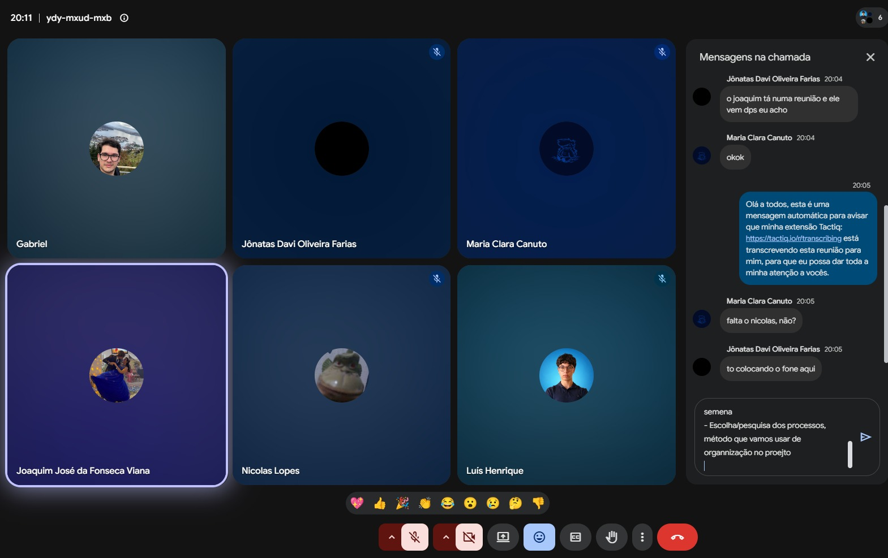
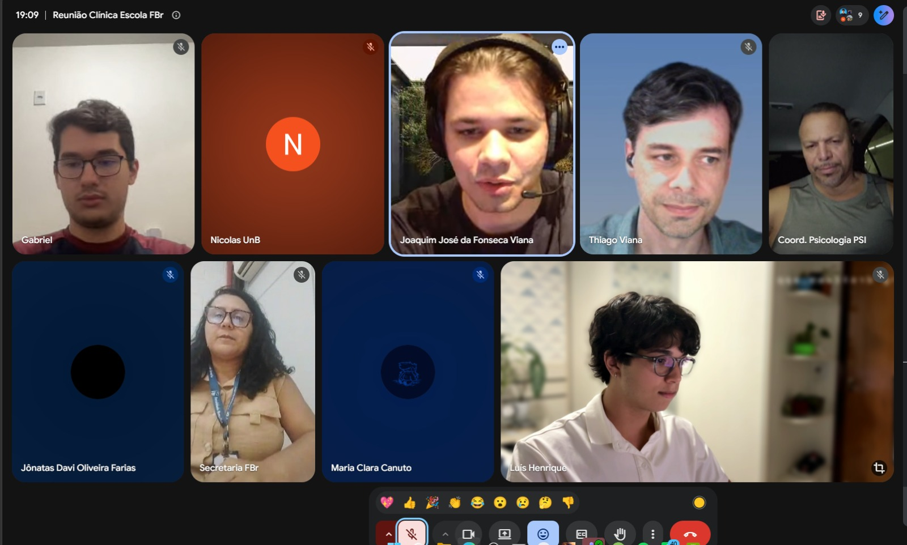
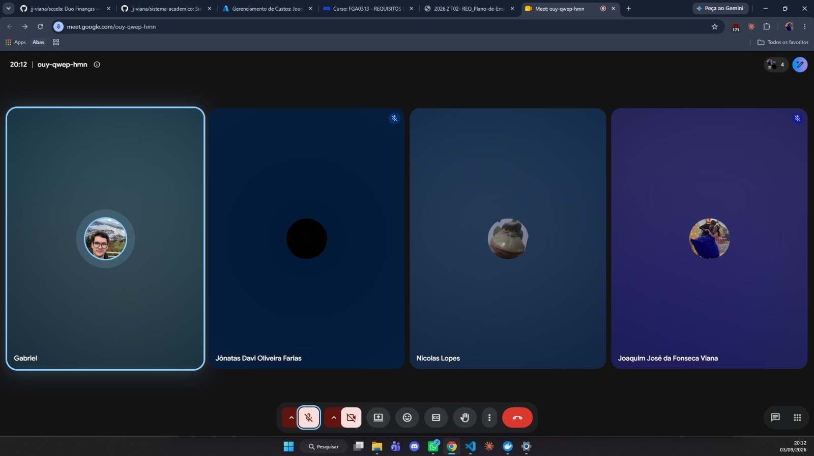

# Unidade 1

Registro das reuniões realizadas durante a Unidade 1 do projeto Clínica Escola FBr.

## Reunião de alinhamento 01

**Data:** 20/08/2026
**Local:** Reunião on-line (Google Meet)
**Participantes:** Gabriel; Joaquim José da Fonseca Viana; Jônatas Davi Oliveira Farias; Luís Henrique; Maria Clara Canuto; Nicolas Lopes.

_Figura 1 — Registro da reunião de alinhamento 01, realizada em 20/08/2026._

[Consultar ata completa em PDF](../assets/atas-reunioes/Ata_Reuniao_01_Projeto_Requisitos.pdf)

### Resumo

O primeiro alinhamento formal da equipe foi realizado para organizar a preparação da reunião com a Faculdade Brasília, as entregas da Unidade 1, o cronograma de curto prazo, a pesquisa sobre abordagem, ciclo de vida e processo de desenvolvimento e a divisão inicial de responsabilidades.

### Pautas e decisões

- Alinhamento das perguntas e dos tópicos para a reunião com a Faculdade Brasília, com foco no cenário atual da Clínica Escola, nos processos, nos atores, nos problemas e nas necessidades.
- Revisão das entregas previstas para a Unidade 1 e dos itens do template de Visão de Produto e Projeto.
- Definição da estratégia de pesquisa e posterior escolha da abordagem, do ciclo de vida e do processo de desenvolvimento.
- Organização do GitHub e do GitHub Pages, aguardando a aprovação da proposta pelo professor antes do início do trabalho definitivo no repositório oficial.
- Definição da importância de concentrar evidências e gestão do trabalho no GitHub, mantendo a rastreabilidade do projeto.
- Divisão das atividades e dos prazos entre os integrantes, com registro das alterações relevantes no histórico de revisão do documento.

### Encaminhamentos

Todos os integrantes ficaram responsáveis por pesquisar alternativas de abordagem, ciclos de vida, processos, tecnologias e ferramentas. Joaquim ficou responsável por adiantar o item 1.2 e preparar o item 2.5; Jônatas, pela formatação final; Luís Henrique, pelo cronograma, pela ata e pelo contato com o professor; e a equipe de perguntas, pela consolidação do roteiro da entrevista.

---

## Reunião de levantamento inicial de requisitos

**Data:** 26/08/2026
**Local:** Reunião on-line (Google Meet)
**Participantes:** Equipe UnB e representantes da Clínica-Escola/FBr.

_Figura 2 — Registro da reunião de levantamento inicial de requisitos, realizada em 26/08/2026._

[Consultar ata completa em PDF](../assets/atas-reunioes/Ata_Reuniao_Clinica_Escola_FBr_26-08-2026_ATUALIZADA.pdf)

### Resumo

A reunião teve como objetivo compreender o funcionamento atual da Clínica-Escola, identificar os principais problemas e levantar requisitos iniciais para orientar o escopo do sistema.

### Cenário e problemas discutidos

- A maior parte do processo é manual, com apoio pontual de planilhas compartilhadas em nuvem.
- O fluxo atual envolve inscrição, identificação e triagem do paciente, distribuição entre supervisores e estagiários, agendamento, pagamento da taxa social, sessões, registro de evolução e relatório final.
- O atendimento psicológico é presencial. A inscrição inicial pode ser digitalizada, mas autorizações e atendimentos permanecem sujeitos às exigências presenciais da clínica.
- O principal gargalo é o agendamento e sua confirmação, incluindo cancelamentos sem aviso, faltas, remarcações e dificuldade de busca ativa.
- Quando uma vaga é liberada, é necessário realocar rapidamente outro paciente para evitar que o estagiário fique sem atendimento.
- O excesso de registros em papel dificulta o rastreamento, o acompanhamento e a consolidação das informações.

### Requisitos e direcionamentos iniciais

- Cadastrar e rastrear pacientes, gerenciar agendamentos, confirmações, cancelamentos e remarcações.
- Identificar o estagiário e o supervisor responsáveis por cada atendimento.
- Controlar faltas e alertar para situações de desligamento conforme as regras da clínica.
- Acompanhar vagas disponíveis e apoiar a realocação de pacientes da fila de espera.
- Registrar a evolução após cada sessão e gerar o relatório final a partir do histórico.
- Emitir declaração automática de comparecimento e apoiar a comunicação com os pacientes.
- Acompanhar o pagamento da taxa social de R$ 35,00.
- Produzir relatórios administrativos e apoiar fiscalizações do Conselho e do MEC.
- Considerar pré-classificação inicial dos pacientes, sempre com revisão humana.

### Restrições e próximos passos

O sigilo das informações psicológicas é uma restrição central. O sistema deverá adotar níveis de acesso adequados aos papéis de estagiários, supervisores e demais usuários, além de evitar exposição desnecessária na consulta à fila de espera. Também deverá ter interface simples, responsiva e acessível, adequada ao uso pelo celular.

O desenvolvimento será modular, começando pelas dores mais relevantes e por um escopo viável no semestre. O mínimo esperado pela clínica é rastrear o paciente, realizar a marcação e identificar o aluno responsável pelo atendimento. A equipe deverá consolidar o documento da proposta, produzir os diagramas das seções responsáveis, revisar o conteúdo e enviá-lo ao professor.

---

## Projeto GitHub Pages — entrega, slides e gravação de vídeo

**Data:** 03/09/2026
**Participantes:** Gabriel da Cunha Barbaceli; Joaquim José da Fonseca Viana; Jônatas Davi Oliveira Farias; Nicolas Lopes.

_Figura 3 — Registro da reunião de acompanhamento do projeto, realizada em 03/09/2026._

[Consultar ata completa em PDF](../assets/atas-reunioes/Ata_Reuniao_03-09-2026.pdf)

### Objetivo

Alinhar a entrega do GitHub Pages, a estrutura da apresentação e a gravação do vídeo.

### 1. Status e prazos

- Joaquim deverá concluir a revisão e sua parte do documento até a tarde de 04/09, após a prova.
- A entrega interna do conteúdo do GitHub Pages ficou prevista, no máximo, para 04/09.
- Embora o cronograma interno previsse a entrega em 03/09, a equipe considerou viável concluí-la em 04/09.
- Todo o conteúdo deverá estar no repositório até sábado, 05/09, para reservar o domingo e a segunda-feira para a gravação e a preparação.
- O prazo mencionado para a gravação do vídeo é 08/09.

### 2. Apresentação

- Foi definido o uso de slides simples como apoio, em vez de realizar a apresentação navegando diretamente pelo GitHub Pages.
- Caso haja tempo, o GitHub Pages poderá ser mostrado rapidamente ao final.
- A duração-alvo é de aproximadamente 10 minutos, com limite máximo planejado de 13 minutos.
- A apresentação deverá ser objetiva e apresentar o software como uma solução para o cliente.
- O conteúdo deverá ser sintetizado, evitando reproduzir integralmente o material já disponível no GitHub Pages.

### 3. Estrutura dos tópicos

A divisão preliminar dos tópicos da apresentação ficou organizada da seguinte forma:

- Cenário atual e intervenção social.
- Solução proposta — parte 1, até o tópico 2.4.
- Solução proposta — parte 2, a partir do tópico 2.4, incluindo viabilidade técnica e stack tecnológica.
- Estratégias de Engenharia de Software.
- Engenharia de Requisitos.
- Gestão de projetos e reuniões.

A página de reuniões será mencionada brevemente dentro do tópico de gestão de projetos.

### 4. Divisão das falas

- Foi considerada como referência a apresentação do tópico redigido por cada integrante, por proporcionar maior familiaridade com o conteúdo.
- Será criada uma enquete no grupo para confirmar quem apresentará cada um dos seis tópicos, incluindo Maria e Luís.
- Luís foi sugerido para os tópicos mais técnicos, especialmente Estratégias de Engenharia de Software e Engenharia de Requisitos.
- Luís já se ofereceu para preparar sua fala antecipadamente.
- A divisão final das falas será definida no grupo.

### 5. Gravação do vídeo

- A data provisória para a gravação é domingo, 06/09.
- O horário será definido no grupo, considerando também Maria e Luís, que estão viajando.
- A primeira opção discutida é realizar a gravação com todos juntos, em uma reunião ou ligação, como simulação do ensaio.
- Caso os horários não coincidam, cada integrante poderá gravar sua parte separadamente para posterior junção dos vídeos.

### 6. Página de reuniões

- Deverá ser adicionada uma foto da reunião à página de reuniões do GitHub Pages.
- Também deverá ser adicionado o link para a ata completa, mantida em uma pasta separada no repositório.
- Gabriel ficou responsável por implementar a imagem em Markdown e o link para o documento completo ao término da reunião.

### 7. Próximos passos

- Gabriel deverá adicionar a foto e o link da ata à página de reuniões.
- A equipe deverá criar a enquete para definir os responsáveis pelos seis tópicos da apresentação.
- A equipe deverá definir no grupo o horário da gravação de domingo, após consultar os integrantes que estão viajando.
- Joaquim deverá concluir a revisão e sua parte do documento até a tarde de 04/09.

### Encerramento

Ficaram encaminhados o prazo interno do GitHub Pages, a estrutura dos slides, a divisão preliminar dos conteúdos e a gravação provisoriamente prevista para domingo, 06/09. A divisão final das falas e o horário da gravação ainda dependem de confirmação no grupo.
