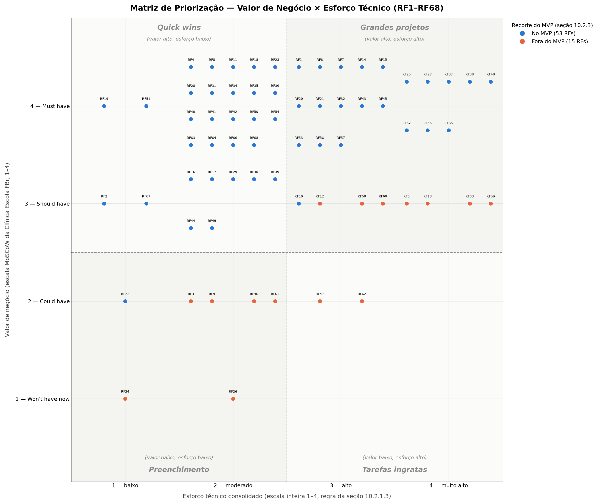

# 10. Backlog de Produto

## 10.2 Priorização e Recorte do MVP

### 10.2.1 Avaliação de Valor de Negócio e de Esforço Técnico

#### 10.2.1.1 Escala e critérios de valor de negócio

O valor de negócio de cada RF foi avaliado pela Clínica Escola FBr — Karla (secretaria) e Robson (coordenador do curso de Psicologia) —, a partir de um rascunho inicial preenchido pela equipe como ponto de partida, conforme alinhado na reunião de 24/09/2026 (ver [Reuniões da Unidade 2](../reunioes.md)). A escala adotada segue o método MoSCoW, com cada categoria associada a uma pontuação mensurável de 1 a 4, de significado claramente definido:

| Pontuação | Classificação | Interpretação |
| --- | --- | --- |
| 4 | Must have | Indispensável para resolver o problema central ou viabilizar o produto |
| 3 | Should have | Muito importante, mas o produto ainda pode operar temporariamente sem o requisito |
| 2 | Could have | Agrega valor, mas pode ser adiado sem comprometer o objetivo principal |
| 1 | Won't have now | Não é prioritário para a versão atual |

A atribuição de cada nota não ficou restrita à etiqueta MoSCoW isolada: para cada RF, a Clínica Escola registrou uma justificativa em frase curta explicando o porquê da nota. Lidas em conjunto, essas justificativas apontam para critérios recorrentes — a importância do requisito para o problema central do projeto (as falhas de agendamento e de confirmação de presença que hoje produzem horários ociosos), a contribuição para os objetivos específicos da [Solução Proposta](../../unidade-1/solucao-proposta.md#22-objetivos-especificos-oe-do-produto), o impacto percebido por pacientes, estagiários e supervisores, e a dependência de outras funcionalidades já priorizadas — mas não seguiram um checklist formal aplicado requisito a requisito. As justificativas individuais estão registradas por RF na coluna "Justificativa do cliente" da tabela consolidada ([10.2.1.4](#10214-tabela-consolidada)).

#### 10.2.1.2 Escalas adotadas

Foram mantidas as três escalas propostas pela disciplina, todas orientadas no mesmo sentido (quanto maior a pontuação, maior o custo ou o risco).

**Esforço necessário para implementação**

| Pontuação | Interpretação | Descrição |
| --- | --- | --- |
| 1 | Esforço baixo | até 2 horas |
| 2 | Esforço moderado | entre 2 e 6 horas |
| 3 | Esforço alto | entre 6 e 12 horas |
| 4 | Esforço muito alto | mais de 12 horas |

O esforço considera o desenvolvimento completo do requisito — persistência, regra de negócio, serviço de aplicação, interface e testes —, conforme o fluxo de construção por feature adotado pela equipe.

**Complexidade técnica**

| Pontuação | Interpretação |
| --- | --- |
| 1 | Utiliza solução conhecida, com poucas dependências |
| 2 | Exige alguma investigação ou integração |
| 3 | Possui várias dependências ou incertezas técnicas |
| 4 | Apresenta elevada incerteza, integração crítica ou tecnologia não dominada |

**Lacuna de capacidade da equipe**

| Pontuação | Interpretação |
| --- | --- |
| 1 | A equipe domina plenamente os conhecimentos necessários |
| 2 | A equipe possui conhecimento suficiente, com pouca aprendizagem adicional |
| 3 | A equipe precisa desenvolver conhecimentos relevantes |
| 4 | A equipe ainda não possui os conhecimentos ou recursos necessários |

#### 10.2.1.3 Regra de consolidação

O esforço técnico consolidado de cada requisito é a média aritmética simples dos três critérios:

```
Esforço técnico = (esforço + complexidade + lacuna de capacidade) / 3
```

Regras definidas previamente e aplicadas de forma uniforme a todos os requisitos:

1. O resultado é apresentado com **uma casa decimal**, com arredondamento matemático padrão (2,666… → 2,7).
2. **Nenhum critério recebe peso maior que os outros.** A equipe considerou ponderar a lacuna de capacidade, mas optou pela média simples para manter a regra previsível e auditável ao longo de todas as CPs.
3. O valor decimal é o valor de referência. Quando for necessário convertê-lo para a escala de 1 a 4 (por exemplo, para posicionar o requisito na matriz 4 × 4), aplica-se o arredondamento para o inteiro mais próximo, com 0,5 arredondado para cima.
4. A avaliação considerou a **descrição completa** de cada requisito, seus critérios de aceitação, suas dependências declaradas e as restrições transversais indicadas na rastreabilidade — não apenas o nome do requisito.

#### 10.2.1.4 Tabela consolidada

| Código | Requisito | CP | Valor de negócio | Justificativa do cliente | Esforço | Complexidade | Lacuna de capacidade | Esforço técnico consolidado |
| --- | --- | --- | --- | --- | --- | --- | --- | --- |
| RF1 | Registrar solicitação de atendimento on-line | CP1 | 4 | Ponto de entrada de todo o fluxo; sem isso nada começa | 4 | 2 | 2 | **2,7** |
| RF2 | Emitir comprovante de inscrição | CP1 | 3 | Importante pro paciente, mas dá pra suprir manualmente no início | 2 | 1 | 1 | **1,3** |
| RF3 | Registrar inscrição assistida | CP1 | 3 | Atende exclusão digital, mas pode ter canal alternativo manual por ora | 2 | 2 | 2 | **2,0** |
| RF4 | Organizar informações da inscrição para triagem | CP2 | 4 | Base para a supervisão fazer a triagem | 2 | 2 | 2 | **2,0** |
| RF5 | Sinalizar pontos de atenção da inscrição | CP2 | 3 | Ajuda a triagem, mas dá pra ler as informações manualmente | 4 | 4 | 3 | **3,7** |
| RF6 | Registrar prioridade clínica do inscrito | CP2 | 4 | Alimenta a ordenação da fila (CP3); sem isso a fila não tem critério | 3 | 3 | 2 | **2,7** |
| RF7 | Ordenar inscritos na fila de espera | CP3 | 4 | Núcleo de como o paciente entra no atendimento | 3 | 3 | 2 | **2,7** |
| RF8 | Consultar posição individual na fila | CP3 | 4 | Melhora a experiência, mas a fila funciona sem essa consulta | 2 | 3 | 2 | **2,3** |
| RF9 | Manter e informar condições gerais da fila | CP3 | 2 | Informação geral, não bloqueia a operação | 3 | 2 | 2 | **2,3** |
| RF10 | Agendar sessão do paciente | CP4 | 3 | Núcleo do agendamento | 4 | 3 | 2 | **3,0** |
| RF11 | Consultar agenda de sessões do estagiário | CP4 | 4 | Estagiário precisa disso pra atuar no dia a dia | 2 | 2 | 1 | **1,7** |
| RF12 | Reagendar sessão do paciente | CP4 | 4 | Importante, mas pode ser tratado manualmente no início | 4 | 4 | 2 | **3,3** |
| RF13 | Enviar lembrete de sessão agendada | CP4 | 3 | Reduz falta, mas não é essencial pra operação existir | 4 | 4 | 4 | **4,0** |
| RF14 | Confirmar presença em sessão agendada | CP4 | 4 | Alimenta assiduidade (CP9), mas dá pra registrar manualmente | 3 | 3 | 3 | **3,0** |
| RF15 | Registrar cancelamento de sessão pelo paciente | CP4 | 3 | Libera vaga, mas dá pra anotar manualmente no início | 3 | 3 | 2 | **2,7** |
| RF16 | Registrar cancelamento de sessão pelo estagiário | CP4 | 3 | Mesma lógica do RF15 | 2 | 2 | 1 | **1,7** |
| RF17 | Notificar paciente sobre ausência do estagiário | CP4 | 3 | Comunicação útil, não bloqueia o fluxo | 2 | 2 | 2 | **2,0** |
| RF18 | Listar casos aguardando distribuição | CP5 | 4 | Visibilidade operacional essencial | 2 | 2 | 1 | **1,7** |
| RF19 | Registrar áreas de especialidade do supervisor | CP5 | 4 | Necessário pra lógica de distribuição funcionar | 2 | 1 | 1 | **1,3** |
| RF20 | Distribuir caso a supervisor conforme área de especialidade | CP5 | 4 | Lógica central de distribuição | 3 | 3 | 2 | **2,7** |
| RF21 | Vincular paciente a estagiário responsável | CP5 | 4 | Base pra tudo que depende de responsável (prontuário, evolução) | 3 | 3 | 2 | **2,7** |
| RF22 | Consultar responsáveis pelo caso | CP5 | 2 | Consulta útil, mas inferível de outras telas no início | 1 | 1 | 1 | **1,0** |
| RF23 | Consultar casos sob responsabilidade do estagiário ou supervisor | CP5 | 4 | Necessário pro trabalho diário de estagiários/supervisores | 2 | 2 | 1 | **1,7** |
| RF24 | Visualizar distribuição de casos por supervisor | CP5 | 2 | Visão gerencial, não bloqueia a operação | 2 | 1 | 1 | **1,3** |
| RF25 | Transferir caso para outro estagiário ou supervisor | CP5 | 3 | Importante, mas pode ser feito manualmente no início | 4 | 4 | 3 | **3,7** |
| RF26 | Consultar histórico de responsáveis do caso | CP5 | 1 | Auditoria/histórico, valioso mas não bloqueia | 2 | 3 | 2 | **2,3** |
| RF27 | Consultar prontuário do paciente | CP6 | 4 | Razão de existir do sistema | 4 | 4 | 3 | **3,7** |
| RF28 | Registrar evolução da sessão realizada | CP7 | 4 | Registro clínico central | 3 | 2 | 2 | **2,3** |
| RF29 | Corrigir evolução registrada | CP7 | 3 | Importante pra qualidade do dado, mas não bloqueia o uso inicial | 3 | 3 | 2 | **2,7** |
| RF30 | Registrar complemento de evolução da sessão | CP7 | 3 | Novo (resposta da FBr); complementa o registro principal, não o substitui | 2 | 2 | 2 | **2,0** |
| RF31 | Consultar evolução de uma sessão específica | CP7 | 4 | Necessário pra continuidade do acompanhamento | 3 | 2 | 2 | **2,3** |
| RF32 | Consultar histórico de evolução do paciente | CP7 | 4 | Necessário pra supervisão e continuidade | 3 | 3 | 2 | **2,7** |
| RF33 | Gerar relatório final de evolução | CP8 | 4 | Entregável importante, mas pode ser compilado manualmente no início | 4 | 4 | 3 | **3,7** |
| RF34 | Registrar falta do paciente na sessão | CP9 | 4 | Dado base para toda a política de faltas | 2 | 2 | 1 | **1,7** |
| RF35 | Contabilizar faltas do paciente no ciclo | CP9 | 4 | Necessário para disparar a política de duas faltas | 2 | 2 | 2 | **2,0** |
| RF36 | Emitir alerta de limite de faltas atingido | CP9 | 4 | Comportamento central da política de assiduidade do paciente | 2 | 2 | 1 | **1,7** |
| RF37 | Desligar paciente por faltas e liberar vaga | CP9 | 4 | Fecha o ciclo da política e libera a vaga para reaproveitamento | 4 | 4 | 3 | **3,7** |
| RF38 | Reverter desligamento de paciente por faltas | CP9 | 4 | Regra de exceção confirmada pela FBr; exige preservar histórico e tratar vaga já realocada | 4 | 4 | 3 | **3,7** |
| RF39 | Consolidar faltas do estagiário para a supervisão | CP9 | 3 | Consulta de apoio à supervisão; não bloqueia o fluxo clínico principal | 2 | 2 | 1 | **1,7** |
| RF40 | Contabilizar faltas do estagiário no semestre | CP9 | 4 | Base para a regra institucional de reprovação por três faltas | 2 | 2 | 2 | **2,0** |
| RF63 | Sinalizar reprovação do estagiário por faltas | CP9 | 4 | Novo requisito derivado da regra confirmada de três faltas; valor de negócio alinhado ao RF40 conforme orientação da equipe | 3 | 2 | 2 | **2,3** |
| RF64 | Registrar decisão institucional sobre a reprovação do estagiário | CP9 | 4 | Completa o fluxo da reprovação do estagiário; valor de negócio alinhado ao RF40 conforme orientação da equipe | 3 | 2 | 2 | **2,3** |
| RF41 | Registrar pagamento da contribuição social | CP10 | 4 | Controle administrativo necessário para a regra institucional da contribuição | 3 | 2 | 2 | **2,3** |
| RF42 | Consultar situação da contribuição social | CP10 | 4 | Dá visibilidade da situação da contribuição aos perfis autorizados | 3 | 2 | 2 | **2,3** |
| RF43 | Bloquear agendamento por contribuição social pendente | CP10 | 4 | Regra de negócio dependente do registro e consulta da contribuição; exige integração com agendamento | 3 | 3 | 2 | **2,7** |
| RF44 | Listar sessões com comparecimento registrado do paciente | CP10 | 3 | Apoia a emissão da declaração de comparecimento | 2 | 2 | 2 | **2,0** |
| RF45 | Emitir declaração de comparecimento do paciente | CP10 | 4 | Entregável externo recorrente e concreto para o paciente | 4 | 3 | 2 | **3,0** |
| RF46 | Reemitir declaração de comparecimento | CP10 | 3 | Suporte útil, mas não é a necessidade principal de emissão | 2 | 2 | 1 | **1,7** |
| RF47 | Validar autenticidade da declaração | CP10 | 2 | Controle antifraude útil, mas não bloqueia o lançamento inicial | 3 | 3 | 2 | **2,7** |
| RF48 | Consultar indicadores operacionais | CP11 | 3 | Valioso para gestão, mas não bloqueia a operação clínica diária | 4 | 4 | 3 | **3,7** |
| RF49 | Exportar relatório institucional em PDF | CP11 | 1 | Conveniência institucional de menor prioridade para a primeira versão | 3 | 2 | 2 | **2,3** |
| RF50 | Autenticar usuário institucional | CP12 | 4 | Base de segurança para todas as funcionalidades internas | 3 | 2 | 2 | **2,3** |
| RF51 | Encerrar sessão do usuário | CP12 | 4 | Controle básico de segurança e sessão | 1 | 1 | 1 | **1,0** |
| RF52 | Verificar identidade do paciente ou responsável | CP12 | 4 | Necessário para acesso seguro a informações pessoais sem login institucional | 4 | 4 | 3 | **3,7** |
| RF53 | Cadastrar usuário institucional | CP12 | 4 | Necessário para provisionar contas e perfis institucionais | 4 | 3 | 3 | **3,3** |
| RF54 | Desativar usuário institucional | CP12 | 4 | Necessário para revogar acesso de usuários que deixam a clínica/estágio | 2 | 2 | 2 | **2,0** |
| RF55 | Restringir acesso ao prontuário | CP12 | 4 | Obrigação de sigilo e proteção de dados de saúde | 4 | 4 | 3 | **3,7** |
| RF56 | Consultar registro de acessos ao prontuário | CP12 | 4 | Trilha de auditoria importante para segurança e conformidade | 3 | 3 | 2 | **2,7** |
| RF57 | Registrar consentimento para tratamento de dados | CP12 | 4 | Base de privacidade/compliance para tratamento de dados no cenário adotado pelo projeto | 3 | 3 | 3 | **3,0** |
| RF65 | Registrar revogação do consentimento | CP12 | 4 | Complementa o fluxo de consentimento e privacidade; valor de negócio alinhado ao RF57 conforme orientação da equipe | 4 | 4 | 3 | **3,7** |
| RF58 | Listar casos elegíveis para continuidade entre semestres | CP13 | 3 | Apoia a virada de semestre; depende de critérios e calendário institucional | 3 | 3 | 2 | **2,7** |
| RF59 | Registrar decisão de continuidade do caso | CP13 | 3 | Registra decisão institucional e suas versões; depende do fluxo de continuidade | 4 | 4 | 3 | **3,7** |
| RF60 | Vincular caso a novo estagiário na continuidade | CP13 | 3 | Efetiva a continuidade com preservação de histórico e troca de responsável | 3 | 3 | 2 | **2,7** |
| RF61 | Ativar modo de alto contraste | CP14 | 2 | Recurso específico de acessibilidade; a acessibilidade geral já é obrigatória pelo RNF56 | 2 | 2 | 2 | **2,0** |
| RF62 | Ajustar tamanho do texto | CP14 | 2 | Recurso específico de acessibilidade complementar ao RNF56 | 3 | 3 | 2 | **2,7** |

#### 10.2.1.5 Classificação dos Requisitos Não Funcionais para o MVP

A classificação abaixo relaciona cada Requisito Não Funcional (RNF) ao recorte final do MVP definido na seção [10.2.3](#1023-definicao-do-mvp), usando quatro categorias: **Obrigatório para o MVP** (aplica-se independentemente do RF específico, por decorrer de exigência transversal de segurança, privacidade, acessibilidade, integridade ou continuidade operacional), **Associado a RF do MVP** (sua aplicabilidade decorre diretamente de um RF que está no MVP), **Evolutivo** (o RF relacionado está no MVP, mas o próprio RNF pode ser refinado em iterações posteriores, sem bloquear o lançamento) e **Não aplicável ao MVP** (depende de um RF que ficou fora do recorte atual, a ser reavaliado se esse RF for incorporado). A classificação foi conferida requisito a requisito contra os 51 RFs efetivamente selecionados na seção 10.2.3 — inclusive a promoção de RF10 e RF13 por dependência.

| Código | Requisito não funcional | Classificação | RF/escopo relacionado | Justificativa |
| --- | --- | --- | --- | --- |
| RNF1 | Identificação e recuperação de erros no formulário | Associado a RF do MVP | RF1 | Aplica-se diretamente à inscrição on-line e evita perda dos dados válidos durante correções. |
| RNF2 | Proteção das informações no comprovante de inscrição | Associado a RF do MVP | RF2 | RF2 está no recorte do MVP (Should have de esforço baixo); o comprovante de inscrição existe desde a primeira versão e sua proteção deve acompanhar o requisito. |
| RNF3 | Sigilo das informações de triagem | Obrigatório para o MVP | CP2 | Protege dados sensíveis de triagem e é condição mínima de privacidade. |
| RNF4 | Rastreabilidade das regras de sinalização | Não aplicável ao MVP | RF5 | Depende da sinalização automática de pontos de atenção; RF5 fica fora do MVP. Reavaliar se RF5 for incorporado. |
| RNF5 | Integridade e auditoria das decisões de prioridade | Obrigatório para o MVP | RF6 | A prioridade clínica afeta a fila e precisa preservar autoria, histórico e integridade. |
| RNF6 | Privacidade e controle de acesso à consulta da fila | Obrigatório para o MVP | RF8, RF52 | A consulta individual envolve dado pessoal e exige verificação de identidade. |
| RNF7 | Compreensibilidade das informações sobre a posição na fila | Associado a RF do MVP | RF8 | Acompanha a consulta de posição e evita interpretação da posição como garantia de prazo. |
| RNF8 | Confiabilidade das informações institucionais da fila | Não aplicável ao MVP | RF9 | Relaciona-se às informações gerais da fila; RF9 fica fora do MVP. Reavaliar se RF9 for incorporado. |
| RNF9 | Integridade do agendamento | Obrigatório para o MVP | CP4 | Evita conflitos de agenda e estados incompatíveis; condição operacional mínima, reforçada pela promoção de RF10 ao MVP. |
| RNF10 | Auditoria das operações sobre a sessão | Associado a RF do MVP | RF10, RF12, RF14, RF16 | Acompanha agendamento, reagendamento, confirmação de presença e cancelamento pelo estagiário — todos no MVP — preservando rastreabilidade das alterações; o cancelamento pelo paciente (RF15) fica fora por ora e entra no escopo de auditoria quando for incorporado. |
| RNF11 | Confiabilidade do envio de lembretes | Associado a RF do MVP | RF13 | RF13 foi promovido ao MVP por dependência (RF14 depende do link de confirmação enviado no lembrete); a meta de confiabilidade do envio acompanha o requisito desde esta primeira versão. |
| RNF12 | Tempo de resposta nas operações de agendamento | Evolutivo | CP4 | Meta quantitativa de desempenho que pode ser calibrada com testes de carga após o fluxo mínimo (RF10–RF12, RF14, RF16–RF17) estar em produção. |
| RNF13 | Minimização de dados na agenda | Obrigatório para o MVP | RF11 | Reduz exposição de dados e atende ao princípio de minimização. |
| RNF14 | Disponibilidade do módulo de agendamento | Evolutivo | CP4 | Meta formal de disponibilidade depende de infraestrutura e monitoramento, a formalizar após o MVP. |
| RNF15 | Usabilidade da confirmação de presença pelo paciente | Associado a RF do MVP | RF14 | Acompanha a confirmação de presença e a proteção do fluxo público. |
| RNF16 | Autorização para distribuição, vínculo e transferência de casos | Obrigatório para o MVP | RF20, RF21 | Alterações de responsabilidade clínica exigem autorização por perfil; a transferência de caso (RF25) fica fora do MVP por ora e será revisitada quando reintroduzida. |
| RNF17 | Privacidade dos dados nas telas de distribuição e consulta | Obrigatório para o MVP | CP5 | As telas de distribuição não devem expor dados além do necessário. |
| RNF18 | Auditoria de atribuições, vínculos e transferências | Associado a RF do MVP | RF20, RF21 | Acompanha distribuição e vínculo de responsáveis e preserva rastreabilidade; a auditoria da transferência (RF25) é tratada quando o requisito voltar ao escopo. |
| RNF19 | Integridade dos vínculos de responsabilidade | Obrigatório para o MVP | RF20, RF21 | Impede vínculos incompatíveis e preserva consistência de responsabilidade. |
| RNF20 | Continuidade do histórico na troca de responsável | Não aplicável ao MVP | RF25 | Depende da transferência de caso; RF25 fica fora do MVP. Reavaliar se for incorporado. |
| RNF21 | Desempenho das listagens e operações de vínculo | Evolutivo | CP5 | Meta de desempenho a refinar com massa de dados representativa. |
| RNF22 | Usabilidade da distribuição e do vínculo de casos | Evolutivo | RF20, RF21 | Meta específica de usabilidade que pode ser refinada após validação do fluxo. |
| RNF23 | Manutenibilidade das áreas de especialidade | Evolutivo | RF19 | Propriedade de modificabilidade importante, mas não impede a operação mínima. |
| RNF24 | Acessibilidade das telas de distribuição e consulta | Obrigatório para o MVP | CP5 | Acessibilidade mínima das interfaces internas deve existir desde a primeira versão utilizável. |
| RNF25 | Sigilo do conteúdo do prontuário | Obrigatório para o MVP | RF27, RF55 | O prontuário contém dados de saúde e exige proteção desde qualquer versão utilizável. |
| RNF26 | Sigilo do conteúdo da evolução | Obrigatório para o MVP | RF28, RF55 | As evoluções contêm dados clínicos sensíveis e exigem sigilo. |
| RNF27 | Integridade e proveniência dos registros de evolução | Obrigatório para o MVP | RF28, RF31, RF32 | Registros clínicos precisam preservar autor, sessão, paciente e histórico. |
| RNF28 | Auditoria das correções de evolução | Não aplicável ao MVP | RF29 | Depende da funcionalidade específica de correção; RF29 fica fora do MVP. Reavaliar se for incorporado. |
| RNF29 | Desempenho do registro e da consulta de evolução | Evolutivo | CP7 | Meta quantitativa de desempenho a aferir após implementação do fluxo funcional. |
| RNF30 | Usabilidade do registro de evolução | Evolutivo | RF28 | Meta de tempo/interações que pode ser refinada com testes de estagiários. |
| RNF31 | Fidelidade e rastreabilidade do relatório final | Associado a RF do MVP | RF33 | Acompanha o relatório final e garante correspondência com as evoluções e versões. |
| RNF32 | Integridade e auditoria da contagem de faltas | Obrigatório para o MVP | RF34–RF38 | A política de faltas pode gerar desligamento; contagem e decisões precisam ser íntegras e auditáveis. |
| RNF33 | Visibilidade do alerta de limite de faltas | Associado a RF do MVP | RF36 | Acompanha o alerta e garante percepção também sem dependência exclusiva de cor. |
| RNF34 | Tempo de liberação da vaga após desligamento | Associado a RF do MVP | RF37 | Acompanha a liberação de vaga e evita ociosidade indevida. |
| RNF35 | Privacidade dos dados de faltas do estagiário | Obrigatório para o MVP | RF39, RF40, RF63, RF64 | Abrange consulta, contagem, sinalização e decisão sobre faltas do estagiário. |
| RNF36 | Auditoria dos registros de contribuição social | Associado a RF do MVP | RF41 | Acompanha registro/correção da contribuição e alteração do parâmetro de valor. |
| RNF37 | Privacidade dos dados na declaração | Associado a RF do MVP | RF45 | Evita inclusão de dados clínicos desnecessários no documento. |
| RNF38 | Autorização para emissão e consulta | Obrigatório para o MVP | RF45, RF50, RF52 | Emissão/consulta envolvem dados pessoais e exigem perfis e identidade verificada. |
| RNF39 | Auditoria de emissões e reemissões | Associado a RF do MVP | RF45, RF46 | Acompanha emissão e reemissão, registrando autoria e operação. |
| RNF40 | Tempo de geração da declaração | Evolutivo | RF45 | Meta de desempenho que pode ser calibrada após o fluxo de emissão. |
| RNF41 | Usabilidade da emissão | Evolutivo | RF45 | Meta de interações/taxa de sucesso a aperfeiçoar em testes posteriores. |
| RNF42 | Portabilidade do documento | Associado a RF do MVP | RF45 | Acompanha a emissão e garante PDF A4 legível para uso externo. |
| RNF43 | Acessibilidade da tela de emissão | Obrigatório para o MVP | RF44, RF45 | A interface de emissão deve atender requisitos mínimos de acessibilidade. |
| RNF44 | Integridade do conteúdo da declaração | Associado a RF do MVP | RF45, RF46 | Garante coerência entre documento emitido/reemitido e registro de origem. |
| RNF45 | Segurança da consulta pública de autenticidade | Não aplicável ao MVP | RF47 | É exclusiva da validação pública de autenticidade; RF47 fica fora do MVP. |
| RNF46 | Atualização dos indicadores operacionais | Não aplicável ao MVP | RF48 | Depende da consulta de indicadores; RF48 fica fora do MVP. Reavaliar se for incorporado. |
| RNF47 | Tempo de geração do relatório institucional | Não aplicável ao MVP | RF48, RF49 | Aplica-se a indicadores/exportação institucional, ambos fora do MVP final. |
| RNF48 | Auditoria de relatórios institucionais | Não aplicável ao MVP | RF49 | É exclusiva da exportação do relatório institucional; RF49 fica fora do MVP. |
| RNF49 | Proteção das credenciais de acesso | Obrigatório para o MVP | RF50, RF53 | Senha, hash e bloqueio contra tentativas são controles mínimos de autenticação. |
| RNF50 | Expiração da sessão por inatividade | Obrigatório para o MVP | RF50, RF51 | Reduz exposição de dados em computadores compartilhados. |
| RNF51 | Criptografia dos dados | Obrigatório para o MVP | Transversal | Protege dados sensíveis em trânsito e em repouso; condição de segurança e privacidade. |
| RNF52 | Trilha de auditoria de acessos ao prontuário | Obrigatório para o MVP | RF55, RF56 | Acesso ao prontuário exige rastreabilidade de acessos permitidos e negados. |
| RNF53 | Cópia de segurança e recuperação dos dados | Obrigatório para o MVP | Transversal | Requisito mínimo de continuidade operacional e preservação dos registros. |
| RNF54 | Auditoria das decisões de continuidade | Não aplicável ao MVP | RF59 | Depende do fluxo de continuidade entre semestres; toda a CP13 (RF58–RF60) fica fora do MVP. |
| RNF55 | Integridade do histórico na continuidade | Não aplicável ao MVP | RF60 | Aplica-se à continuidade/transferência entre semestres; RF60 fica fora do MVP. |
| RNF56 | Conformidade com WCAG 2.2 nível AA | Obrigatório para o MVP | CP14 / páginas externas | Acessibilidade foi confirmada como mandatória pela FBr/MEC e deve existir desde o MVP, mesmo com RF61 e RF62 fora do recorte técnico. |
| RNF57 | Aparência reforçada do indicador de foco | Evolutivo | RF61, RF62 / páginas externas | Exigência adicional de nível AAA; RF61 e RF62 ficam fora do MVP, mas a meta AA do RNF56 permanece obrigatória. |
| RNF58 | Responsividade da interface | Obrigatório para o MVP | Páginas externas | A solução é web responsiva e precisa funcionar entre 320 e 1920 px sem perda funcional. |

### 10.2.2 Matriz de Priorização (Valor de Negócio × Esforço Técnico)

A matriz cruza o valor de negócio de cada RF (1 a 4, resposta da Clínica Escola FBr à planilha de avaliação) com o esforço técnico consolidado, convertido para a escala inteira de 1 a 4 pela regra 3 da seção [10.2.1.3](#10213-regra-de-consolidacao) (arredondamento para o inteiro mais próximo, com 0,5 para cima). Os 65 RFs atualmente declarados (RF1 a RF65) estão distribuídos no gráfico abaixo, dividido nos quatro quadrantes apresentados pelo professor na atividade: **Quick wins** (valor alto, esforço baixo), **Grandes projetos** (valor alto, esforço alto), **Preenchimento** (valor baixo, esforço baixo) e **Tarefas ingratas** (valor baixo, esforço alto).



Os pontos em azul compõem o recorte de MVP proposto na seção 10.2.3; os pontos em laranja ficam para uma versão posterior. Dentro de cada célula da matriz (mesmo valor e mesmo esforço), os RFs são dispersos lado a lado apenas para permitir a leitura individual de cada ponto — essa dispersão não representa nenhuma ordem adicional de prioridade dentro da célula. A tabela completa com o valor, o esforço e a decisão de MVP de cada RF, célula a célula, está detalhada na seção 10.2.3 a seguir.

### 10.2.3 Definição do MVP

O corte de MVP foi definido a partir da própria escala de valor de negócio usada na avaliação com a Clínica Escola FBr, que segue o MoSCoW (4 — *Must have*, indispensável; 3 — *Should have*, o sistema opera um tempo sem isso; 2 — *Could have*, agrega valor mas pode esperar; 1 — *Won't have now*, não é prioridade para esta versão). O esforço técnico entra como critério de desempate dentro de cada faixa de valor, para não inflar o MVP com itens caros que o próprio valor de negócio já qualifica como adiáveis:

1. **Valor 4 (Must have):** entra no MVP independentemente do esforço técnico. Por definição, o sistema não funciona sem esses requisitos.
2. **Valor 1 (Won't have now):** fica fora do MVP independentemente do esforço técnico, porque o próprio cliente já definiu que não é prioridade para esta versão.
3. **Valor 3 (Should have):** entra no MVP somente com esforço técnico baixo ou moderado (1 ou 2). Com esforço alto ou muito alto (3 ou 4), fica para depois — o sistema consegue operar um tempo sem esses requisitos, e não vale o risco de entregar algo caro que não é indispensável.
4. **Valor 2 (Could have):** entra no MVP somente com esforço técnico muito baixo (1), quando o custo de entregar já é praticamente o de não entregar. Com esforço 2 ou mais, fica para depois.
5. **Exceção por dependência funcional:** um requisito que a regra 3 ou 4 excluiria pode ser promovido ao MVP quando outros requisitos já incluídos dependem diretamente dele para formar um fluxo de uso minimamente completo — situação prevista no enunciado da atividade ("Um RF de alto valor e alto esforço não deve ser automaticamente descartado" e a necessidade de "formar um fluxo de uso minimamente completo"). Essa exceção foi aplicada duas vezes (ver tabela abaixo): a RF10 — RF11, RF12, RF14, RF16, RF17 e RF43 já estão no MVP e pressupõem uma sessão previamente agendada, sem a qual esses seis requisitos não têm sobre o que operar; e a RF13 — RF14 (Must have, no MVP) só consegue ser executado a partir do link de confirmação de presença que, conforme a própria descrição do requisito, é enviado exclusivamente no lembrete automático (RF13); sem RF13, não existe canal para o paciente confirmar presença, e nenhuma outra feature declarada oferece esse mesmo link. A regra 3 classificaria RF10 e RF13 como fora do MVP (ambos Should have, esforço alto); a exceção por dependência os promove para dentro. Nenhum outro RF excluído pelas regras 1–4 tem essa mesma condição de bloqueio: os demais RFs fora do MVP (RF5, RF9, RF15, RF25, RF26, RF29, RF47, RF48, RF49, RF58, RF59, RF60, RF61, RF62) são consultas, refinamentos ou fluxos que os RFs do MVP não pressupõem como pré-condição de existir. Em particular, RF5 aparece como "Dependência: RF4/RF5" na rastreabilidade de RF6 (CP2), mas a notação indica fontes alternativas de insumo para a decisão do supervisor — a própria RF6 descreve a classificação como julgamento clínico apoiado nas "informações e sinalizações disponíveis", e as informações organizadas por RF4 (no MVP) já bastam para essa decisão, com a sinalização automática de RF5 como reforço opcional. RF15 e RF29, por sua vez, aparecem como "Dependência" na rastreabilidade de RF34/RF35 (CP9) e de RF31/RF32 (CP7), respectivamente, mas apenas para casos de borda (diferenciar falta de cancelamento; exibir correções, quando existirem) que essas features do MVP continuam operando corretamente sem RF15/RF29. Em nenhum desses três casos a ausência do RF fora do MVP deixa o RF do MVP sem nada sobre o que operar — ao contrário de RF10 e RF13, cuja ausência impede por completo a execução dos RFs do MVP que dependem deles.

Aplicando o critério aos 65 RFs (RF1 a RF65): **51 entram no MVP** e **14 ficam para uma versão posterior** — 39 por serem *Must have*, 8 *Should have* de baixo esforço, 2 *Should have* de esforço alto promovidos por dependência (RF10 e RF13) e 2 *Could have* de esforço mínimo; dos 14 de fora, 8 são *Should have* de esforço alto, 4 são *Could have* de esforço moderado/alto e 2 são *Won't have now*.

A tabela abaixo aplica o critério requisito a requisito, mantendo a rastreabilidade entre CP, valor de negócio, esforço técnico e a decisão:

| Código | CP | Valor de negócio | Esforço técnico (1-4) | No MVP? | Motivo |
| --- | --- | --- | --- | --- | --- |
| RF1 | CP1 | 4 | 3 | Sim | Must have — indispensável; entra independentemente do esforço. |
| RF2 | CP1 | 3 | 1 | Sim | Should have com esforço baixo/moderado — vale entregar já. |
| RF3 | CP1 | 3 | 2 | Sim | Should have com esforço baixo/moderado — vale entregar já. |
| RF4 | CP2 | 4 | 2 | Sim | Must have — indispensável; entra independentemente do esforço. |
| RF5 | CP2 | 3 | 4 | Não | Should have com esforço alto — o sistema opera um tempo sem isso; adiado para reduzir risco do MVP. |
| RF6 | CP2 | 4 | 3 | Sim | Must have — indispensável; entra independentemente do esforço. |
| RF7 | CP3 | 4 | 3 | Sim | Must have — indispensável; entra independentemente do esforço. |
| RF8 | CP3 | 4 | 2 | Sim | Must have — indispensável; entra independentemente do esforço. |
| RF9 | CP3 | 2 | 2 | Não | Could have com esforço moderado/alto — pode esperar, conforme a própria definição do cliente. |
| RF10 | CP4 | 3 | 3 | Sim | Should have com esforço alto, mas promovido ao MVP por dependência: RF11, RF12, RF14, RF16, RF17 e RF43 (todos no MVP) pressupõem uma sessão já agendada — sem RF10 esses RFs não têm sobre o que operar, quebrando o fluxo mínimo de uso. |
| RF11 | CP4 | 4 | 2 | Sim | Must have — indispensável; entra independentemente do esforço. |
| RF12 | CP4 | 4 | 3 | Sim | Must have — indispensável; entra independentemente do esforço. |
| RF13 | CP4 | 3 | 4 | Sim | Should have com esforço alto, mas promovido ao MVP por dependência: RF14 (Must have, no MVP) depende do link de confirmação de presença enviado exclusivamente no lembrete — sem RF13, RF14 não tem como ser executado. |
| RF14 | CP4 | 4 | 3 | Sim | Must have — indispensável; entra independentemente do esforço. |
| RF15 | CP4 | 3 | 3 | Não | Should have com esforço alto — o sistema opera um tempo sem isso; adiado para reduzir risco do MVP. |
| RF16 | CP4 | 3 | 2 | Sim | Should have com esforço baixo/moderado — vale entregar já. |
| RF17 | CP4 | 3 | 2 | Sim | Should have com esforço baixo/moderado — vale entregar já. |
| RF18 | CP5 | 4 | 2 | Sim | Must have — indispensável; entra independentemente do esforço. |
| RF19 | CP5 | 4 | 1 | Sim | Must have — indispensável; entra independentemente do esforço. |
| RF20 | CP5 | 4 | 3 | Sim | Must have — indispensável; entra independentemente do esforço. |
| RF21 | CP5 | 4 | 3 | Sim | Must have — indispensável; entra independentemente do esforço. |
| RF22 | CP5 | 2 | 1 | Sim | Could have com esforço muito baixo — praticamente gratuito, entra. |
| RF23 | CP5 | 4 | 2 | Sim | Must have — indispensável; entra independentemente do esforço. |
| RF24 | CP5 | 2 | 1 | Sim | Could have com esforço muito baixo — praticamente gratuito, entra. |
| RF25 | CP5 | 3 | 4 | Não | Should have com esforço alto — o sistema opera um tempo sem isso; adiado para reduzir risco do MVP. |
| RF26 | CP5 | 1 | 2 | Não | Won't have now — o próprio cliente definiu que não é prioridade para esta versão. |
| RF27 | CP6 | 4 | 4 | Sim | Must have — indispensável; entra independentemente do esforço. |
| RF28 | CP7 | 4 | 2 | Sim | Must have — indispensável; entra independentemente do esforço. |
| RF29 | CP7 | 3 | 3 | Não | Should have com esforço alto — o sistema opera um tempo sem isso; adiado para reduzir risco do MVP. |
| RF30 | CP7 | 3 | 2 | Sim | Should have com esforço baixo/moderado — vale entregar já. |
| RF31 | CP7 | 4 | 2 | Sim | Must have — indispensável; entra independentemente do esforço. |
| RF32 | CP7 | 4 | 3 | Sim | Must have — indispensável; entra independentemente do esforço. |
| RF33 | CP8 | 4 | 4 | Sim | Must have — indispensável; entra independentemente do esforço. |
| RF34 | CP9 | 4 | 2 | Sim | Must have — indispensável; entra independentemente do esforço. |
| RF35 | CP9 | 4 | 2 | Sim | Must have — indispensável; entra independentemente do esforço. |
| RF36 | CP9 | 4 | 2 | Sim | Must have — indispensável; entra independentemente do esforço. |
| RF37 | CP9 | 4 | 4 | Sim | Must have — indispensável; entra independentemente do esforço. |
| RF38 | CP9 | 4 | 4 | Sim | Must have — indispensável; entra independentemente do esforço. |
| RF39 | CP9 | 3 | 2 | Sim | Should have com esforço baixo/moderado — vale entregar já. |
| RF40 | CP9 | 4 | 2 | Sim | Must have — indispensável; entra independentemente do esforço. |
| RF63 | CP9 | 4 | 2 | Sim | Must have — indispensável; entra independentemente do esforço. |
| RF64 | CP9 | 4 | 2 | Sim | Must have — indispensável; entra independentemente do esforço. |
| RF41 | CP10 | 4 | 2 | Sim | Must have — indispensável; entra independentemente do esforço. |
| RF42 | CP10 | 4 | 2 | Sim | Must have — indispensável; entra independentemente do esforço. |
| RF43 | CP10 | 4 | 3 | Sim | Must have — indispensável; entra independentemente do esforço. |
| RF44 | CP10 | 3 | 2 | Sim | Should have com esforço baixo/moderado — vale entregar já. |
| RF45 | CP10 | 4 | 3 | Sim | Must have — indispensável; entra independentemente do esforço. |
| RF46 | CP10 | 3 | 2 | Sim | Should have com esforço baixo/moderado — vale entregar já. |
| RF47 | CP10 | 2 | 3 | Não | Could have com esforço moderado/alto — pode esperar, conforme a própria definição do cliente. |
| RF48 | CP11 | 3 | 4 | Não | Should have com esforço alto — o sistema opera um tempo sem isso; adiado para reduzir risco do MVP. |
| RF49 | CP11 | 1 | 2 | Não | Won't have now — o próprio cliente definiu que não é prioridade para esta versão. |
| RF50 | CP12 | 4 | 2 | Sim | Must have — indispensável; entra independentemente do esforço. |
| RF51 | CP12 | 4 | 1 | Sim | Must have — indispensável; entra independentemente do esforço. |
| RF52 | CP12 | 4 | 4 | Sim | Must have — indispensável; entra independentemente do esforço. |
| RF53 | CP12 | 4 | 3 | Sim | Must have — indispensável; entra independentemente do esforço. |
| RF54 | CP12 | 4 | 2 | Sim | Must have — indispensável; entra independentemente do esforço. |
| RF55 | CP12 | 4 | 4 | Sim | Must have — indispensável; entra independentemente do esforço. |
| RF56 | CP12 | 4 | 3 | Sim | Must have — indispensável; entra independentemente do esforço. |
| RF57 | CP12 | 4 | 3 | Sim | Must have — indispensável; entra independentemente do esforço. |
| RF65 | CP12 | 4 | 4 | Sim | Must have — indispensável; entra independentemente do esforço. |
| RF58 | CP13 | 3 | 3 | Não | Should have com esforço alto — o sistema opera um tempo sem isso; adiado para reduzir risco do MVP. |
| RF59 | CP13 | 3 | 4 | Não | Should have com esforço alto — o sistema opera um tempo sem isso; adiado para reduzir risco do MVP. |
| RF60 | CP13 | 3 | 3 | Não | Should have com esforço alto — o sistema opera um tempo sem isso; adiado para reduzir risco do MVP. |
| RF61 | CP14 | 2 | 2 | Não | Could have com esforço moderado/alto — pode esperar, conforme a própria definição do cliente. |
| RF62 | CP14 | 2 | 3 | Não | Could have com esforço moderado/alto — pode esperar, conforme a própria definição do cliente. |

**Este recorte é uma proposta técnica da equipe**, construída a partir dos dados já validados com a FBr (valor de negócio) e da avaliação interna de esforço; segue para validação em conjunto com a equipe antes de ser considerado definitivo, no mesmo espírito das demais pendências registradas na [seção 8.3](analise-feedback.md#pendencias-de-validacao-com-a-fbr). A classificação dos RNFs para o MVP (seção [10.2.1.5](#10215-classificacao-dos-requisitos-nao-funcionais-para-o-mvp)) já reflete este recorte final de 51 RFs, incluindo a promoção de RF10 e RF13 por dependência.

### 10.2.4 Validação do MVP com o Cliente

> **Pendente.** O recorte das seções [10.2.1](#1021-avaliacao-de-valor-de-negocio-e-de-esforco-tecnico) a [10.2.3](#1023-definicao-do-mvp) é, até este ponto, uma proposta técnica da equipe a partir do valor de negócio já avaliado pela Clínica Escola FBr (seção 8 de [analise-feedback.md](analise-feedback.md)) e do esforço técnico avaliado internamente. Falta validar esse recorte final do MVP diretamente com a FBr antes de considerá-lo definitivo. Esta seção será preenchida com o registro dessa validação assim que ela ocorrer, contendo:

- **Quem participou:** _a preencher — representante(s) da Clínica Escola FBr e da equipe presentes na validação._
- **Quando ocorreu:** _a preencher — data da reunião ou troca de validação._
- **RFs aprovados para o MVP:** _a preencher — confirmação (ou ajuste) do recorte de 51 RFs da seção [10.2.3](#1023-definicao-do-mvp)._
- **RNFs aplicáveis ao MVP:** _a preencher — confirmação (ou ajuste) da classificação da seção [10.2.1.5](#10215-classificacao-dos-requisitos-nao-funcionais-para-o-mvp)._
- **Requisitos que ficaram para entregas futuras:** _a preencher — confirmação da lista de RFs/RNFs fora do recorte atual._
- **Ajustes solicitados pelo cliente:** _a preencher._
- **Decisões ou divergências registradas:** _a preencher._
