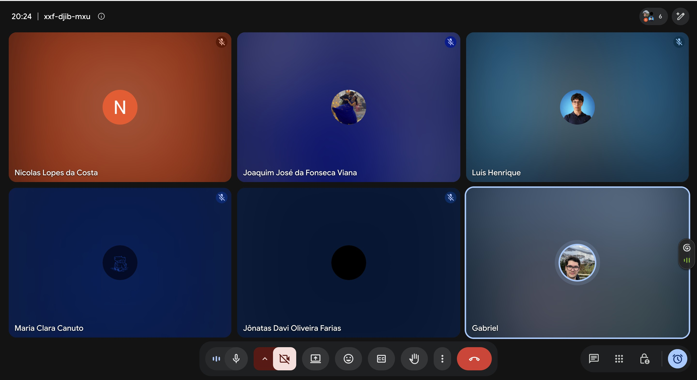
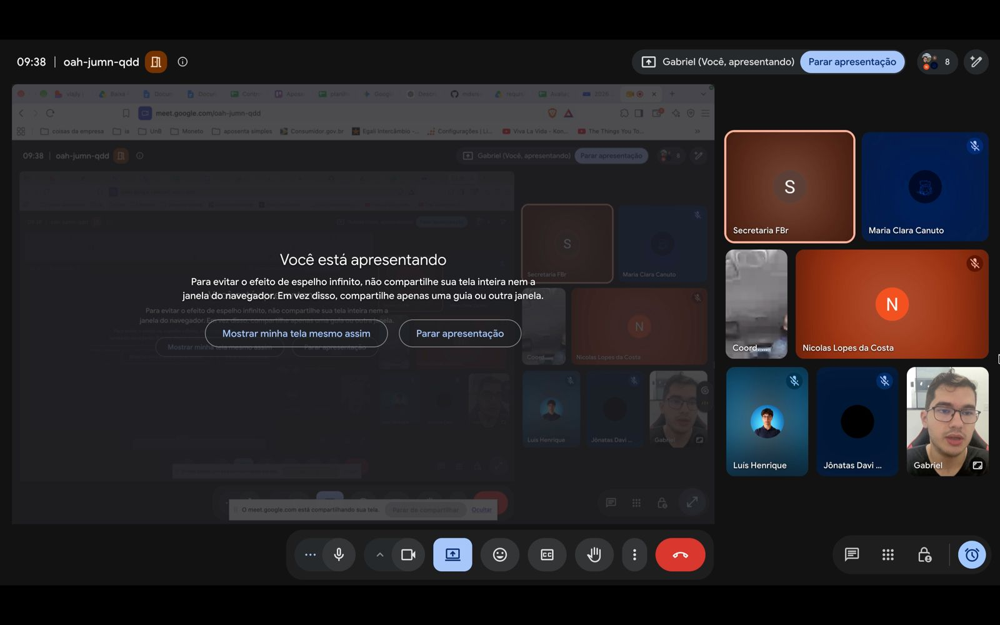
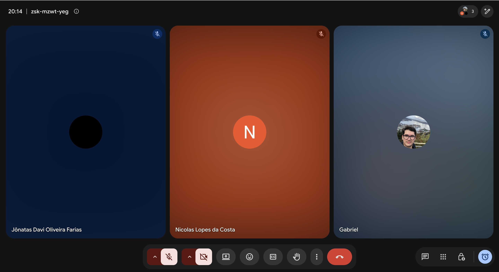

# Reuniões da Unidade 2

Esta página reúne os registros das reuniões realizadas durante a Unidade 2 para elicitação, análise, priorização, validação e acompanhamento dos requisitos do projeto Clínica Escola FBr.

## Reunião de divisão de tarefas e requisitos (FDD) até 22/09

**Data:** 17/09/2026
**Local:** Reunião on-line (Google Meet)
**Participantes:** Gabriel da Cunha Barbaceli; Joaquim José da Fonseca Viana; Jônatas Davi Oliveira Farias; Luís Henrique; Maria Clara Canuto; Nicolas Lopes da Costa.

_Figura 4 — Registro da reunião de divisão de tarefas e requisitos (FDD), realizada em 17/09/2026._

[Consultar ata completa em PDF](../assets/atas-reunioes/Ata_Reuniao_Divisao_Tarefas_FDD_17-09-2026.pdf)

### Resumo

A reunião teve como objetivo distribuir as tarefas da equipe, priorizar as correções das issues abertas pelo professor e alinhar o levantamento de requisitos conforme o processo FDD, visando à entrega de 22/09.

### 1. Entregas prioritárias até 22/09

- Corrigir o grupo 1 de issues abertas pelo professor, considerado o conjunto mais urgente; as demais ficam para depois do dia 24.
- Executar em paralelo o levantamento de requisitos da atividade com entrega até 22/09.
- Concluir os materiais preferencialmente até 21/09, permitindo consolidação e revisão antes da entrega.

### 2. Divisão das issues prioritárias

- Nicolas: solução proposta.
- Gabriel: cronograma e entregas.
- Luís: processo de engenharia de requisitos.
- Jônatas: intervenção social.
- Maria Clara: cenário atual.

As issues estão no GitHub. Os integrantes podem ser atribuídos como responsáveis, mas não devem fechar as issues; após os PRs e a entrada na main, o monitor deve ser avisado para realizar o fechamento.

### 3. Divisão das características de produto

- Jônatas: CP1 — inscrição on-line; CP3 — fila de espera e consulta de posição.
- Maria Clara: CP5 — distribuição dos casos entre supervisores e estagiários; CP9 — emissão de declaração de comparecimento.
- Luís: CP2 — triagem e classificação de prioridade; CP6 — prontuário eletrônico, evolução e relatório final.
- Joaquim: CP11 — segurança, sigilo e controle de acesso; CP8 — registro da contribuição social.
- Nicolas: CP4 — agendamento, confirmação e remarcação; CP7 — controle de assiduidade e alertas.
- Gabriel: CP12 — acessibilidade e usabilidade; CP10 — indicadores e relatórios institucionais.

O levantamento deve seguir o processo de FDD, incluindo features e áreas correspondentes, e não apenas a separação entre requisitos funcionais e não funcionais. A página "Estudos de FDD", na Unidade 1, foi indicada como referência.

### 4. Apoio e acompanhamento

- A equipe deve se apoiar mutuamente nas dúvidas sobre as características e o trabalho de cada integrante.
- Joaquim poderá apoiar dúvidas relacionadas às características de produto que ele elaborou.
- Foi sugerida uma reunião semanal com o monitor, possivelmente às quintas-feiras à noite, conforme a disponibilidade dele.
- Gabriel ficou de cobrar o monitor sobre o fechamento de uma issue relacionada ao vídeo da apresentação e verificar sua disponibilidade para acompanhamento semanal.

### 5. Próximas reuniões e abordagem

- Para a semana a partir de 24/09, considerar reuniões com o pessoal da faculdade para avaliar o valor de negócio e validar o MVP.
- Como foi escolhida uma abordagem ágil, foi discutida a necessidade de contato frequente com o cliente, com sugestão de reuniões pelo menos a cada 15 dias.
- Os contatos com o cliente devem permitir ajustes e alinhamento com a abordagem adotada e com o processo FDD.

### 6. Organização e documentação

- A divisão de tarefas foi disponibilizada no grupo (WhatsApp) para consulta.
- A reunião foi registrada e a ata incluída na documentação do projeto.
- Foi sugerida a criação de um documento para facilitar o entendimento do ciclo e dos processos; antes disso, foi indicada a consulta à página "Estudos de FDD" da Unidade 1.

### Encerramento

A reunião definiu a divisão das tarefas para a entrega de 22/09, priorizando as issues mais urgentes e o levantamento de requisitos conforme o FDD. A equipe buscará consolidar os materiais até 21/09 para revisão e alinhar o acompanhamento com o monitor e as próximas reuniões.

---

## Reunião de avaliação de valor de negócio com a Clínica Escola FBr

**Data:** 24/09/2026
**Local:** Reunião on-line (Google Meet)
**Participantes:** Gabriel da Cunha Barbaceli; Luís Henrique; Maria Clara Canuto; Nicolas Lopes da Costa; Jônatas Davi Oliveira Farias; Robson — coordenador do curso de Psicologia (FBr); Karla — secretaria (FBr).

_Figura 5 — Registro da reunião de avaliação de valor de negócio com a Clínica Escola FBr, realizada em 24/09/2026._

[Consultar ata completa em PDF](../assets/atas-reunioes/Ata_Reuniao_Clinica_Escola_FBr_24-09-2026.pdf)

### Resumo

A reunião apresentou à Clínica Escola FBr o processo e a planilha de avaliação de valor de negócio dos 62 requisitos funcionais levantados até o momento, atendendo à solicitação do professor de que a definição do MVP fosse feita de forma técnica, e não por achismo.

### Contexto

- O projeto segue sem problemas relevantes; a equipe ainda não iniciou a codificação, estando na fase de levantamento e detalhamento técnico dos requisitos.
- As dúvidas anteriores sobre a ficha de inscrição/anamnese e as restrições de acesso administrativo, levantadas em reunião anterior, já haviam sido esclarecidas por escrito por Robson antes deste encontro.
- Cronograma esperado: início da codificação em outubro; MVP concluído no início de dezembro, ao fim do semestre da equipe; caso confirmado, as inscrições da Clínica Escola passam a ser feitas via sistema a partir de janeiro.

### Processo de avaliação de valor de negócio

- Escala de 1 a 4 apresentada à Clínica Escola: 4 — indispensável (deve estar no MVP); 3 — muito importante, mas o sistema opera um tempo sem isso; 2 — agrega valor, mas pode esperar; 1 — não é prioridade para esta versão.
- A equipe entregou uma planilha com os 62 RFs (título, descrição e uma avaliação-rascunho própria, com justificativa) como ponto de partida.
- A Clínica Escola deve revisar cada linha e preencher a nota final, a justificativa e, quando houver divergência da avaliação da equipe, um campo de observação.
- Dado o volume de requisitos, não seriam discutidos individualmente na reunião; foi trabalhado um exemplo (RF1) para alinhar o entendimento, e a planilha foi enviada à Clínica Escola para preencher o restante.

### Pontos discutidos

- RF1 — Registrar solicitação de atendimento on-line: avaliação da equipe (4 — indispensável) confirmada por Karla, que reforçou ser o primeiro passo a ser implementado no sistema.
- RF2 — Emitir comprovante de inscrição: ficou em aberto o mecanismo de identificação do comprovante — código único ou CPF do paciente como credencial de acesso, associado a uma senha. Karla sugeriu o uso do CPF, por ser mais individualizado e, na visão dela, mais simples de implementar; a equipe ainda vai decidir, possivelmente consultando Robson. Também ficou em aberto o canal de confirmação da inscrição (site, e-mail ou aviso na tela).

### Decisões

- A Clínica Escola (Karla e Robson) vai preencher a planilha de avaliação de valor de negócio dos 62 requisitos, a partir do rascunho da equipe.
- Após a devolutiva, a equipe vai cruzar essa avaliação com o esforço técnico de implementação de cada requisito para chegar à proposta técnica de MVP.
- A proposta de MVP resultante será enviada de volta à Clínica Escola para validação.

### Próximos passos

- Até 25/09 (noite): Karla revisa a planilha e tenta concluir o preenchimento.
- Até o fim de semana (26 a 28/09), no máximo: devolutiva completa da planilha pela Clínica Escola.
- 29/09: entrega da atividade da equipe ao professor da disciplina.
- Equipe: recuperar e repassar ao grupo o e-mail do professor Robson mencionado na chamada, e, após a devolutiva, cruzar valor de negócio com esforço técnico para montar a proposta de MVP.

### Encerramento

A reunião alinhou a metodologia de avaliação de valor de negócio dos requisitos com a Clínica Escola, com Karla assumindo o preenchimento da planilha ainda essa semana. O próximo passo da equipe é cruzar essas notas com o esforço técnico de implementação para propor tecnicamente o MVP, a ser validado com a Clínica Escola antes do início da codificação.

---

## Reunião de divisão de tarefas: revisão de requisitos e priorização do MVP

**Data:** 24/09/2026
**Local:** Reunião on-line (Google Meet)
**Participantes:** Gabriel da Cunha Barbaceli; Jônatas Davi Oliveira Farias; Nicolas Lopes da Costa.

_Figura 6 — Registro da reunião de divisão de tarefas: revisão de requisitos e priorização do MVP, realizada em 24/09/2026._

[Consultar ata completa em PDF](../assets/atas-reunioes/Ata_Reuniao_Divisao_Tarefas_Requisitos_MVP_24-09-2026.pdf)

### Resumo

A reunião formalizou a divisão da equipe em dois subgrupos para as duas entregas de 29/09: correção dos requisitos a partir do feedback recebido de outra equipe, e priorização dos requisitos com definição técnica do MVP.

### Contexto

- A equipe precisa entregar duas atividades até 29/09, ao meio-dia: a correção dos RFs/RNFs apontados pela equipe "sem requisitos" e a priorização dos requisitos com definição técnica do MVP.
- Gabriel já havia definido previamente a divisão em dois subgrupos e usou a reunião para comunicar e detalhar essa divisão ao grupo.

### Decisões

- A equipe foi dividida em dois subgrupos: Maria Clara, Luís e Joaquim ficam com a correção dos requisitos; Gabriel, Nicolas e Jônatas ficam com a priorização e definição do MVP.
- Nicolas pontua o esforço técnico dos requisitos funcionais de CP1 a CP7 (RF1 a RF32).
- Jônatas pontua o esforço técnico dos requisitos funcionais de CP8 a CP14 (RF33 a RF62) e classifica os requisitos não funcionais.
- Após receber as pontuações, Gabriel cruza o resultado com o valor de negócio já preenchido por Robson (Clínica Escola FBr) para montar a matriz de priorização e a proposta de MVP.
- O escopo de MVP levantado na primeira call com a FBr, que ficou muito amplo, não será usado como ponto de partida — o MVP será definido do zero, a partir da matriz de priorização.

### Pontos discutidos

- Um integrante estava com uma PR pendente por dúvida sobre o escopo do MVP levantado anteriormente com a FBr, ainda sem resposta do professor. Gabriel orientou que esse escopo prévio não é mais válido para a atividade atual, e que o tamanho do MVP só deve ser reavaliado depois de pronta a matriz de priorização, com apoio do monitor se necessário.
- Ainda não há data marcada para uma nova reunião com a Clínica Escola FBr; a ideia inicial é enviar a proposta de MVP para aprovação pelo grupo do WhatsApp, deixando uma conversa mais formal para quando a equipe começar a implementar funcionalidades.
- O monitor não confirmou presença nesta reunião; Gabriel pretende buscar uma call individual com ele para atualizá-lo sobre o andamento.

### Próximos passos

- Até 26/09: prazo preferencial para Nicolas e Jônatas concluírem a pontuação de esforço técnico.
- Até 27/09 (noite), no limite manhã de 28/09: prazo final para a entrega das pontuações, dando tempo para Gabriel montar a matriz e a proposta de MVP.
- 29/09, até meio-dia: entrega das duas atividades ao professor da disciplina.

### Encerramento

A reunião formalizou a divisão da equipe em dois subgrupos e detalhou as responsabilidades de cada um nas duas entregas de 29/09. O próximo passo é Nicolas e Jônatas pontuarem o esforço técnico dos requisitos, para que Gabriel possa cruzar com o valor de negócio da FBr e propor o MVP.
